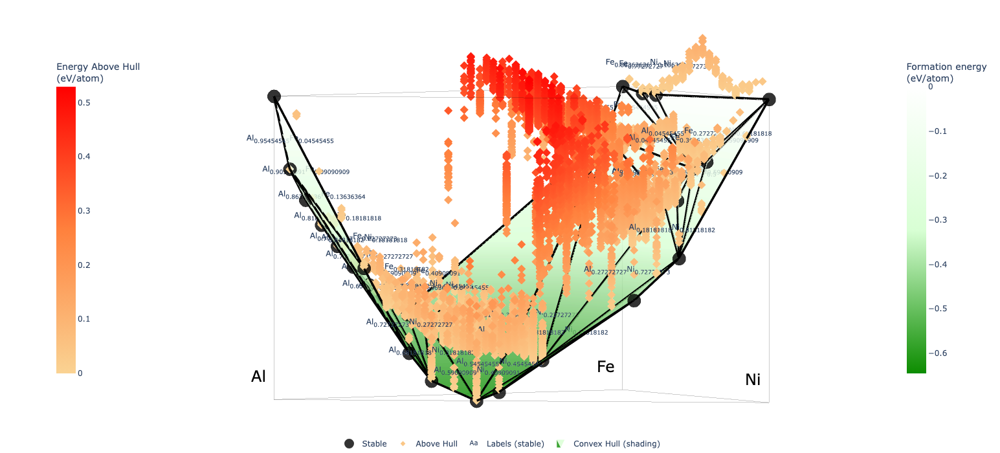

# FGM_elasticmap
This the package of for FGM elastic map
1. Structure builder folder is for gernerating the endmembers, dilute and SQS structures, check the example demostrate in the Jupyternotebook [Structure_builder_ternary_exam.ipynb](./Structure_Builder/Structure_builder_ternary_exam.ipynb)
2. Get the stable strucutres on the convex hull suggesting by machine learning method Pysipfenn.

## Stable sturctures of T1 phase along all the composition:

3. CALPHAD Modeling of the elastic constant as function of compositionand and T

In preparation

4. Generation of the elastic map 

In preparation

